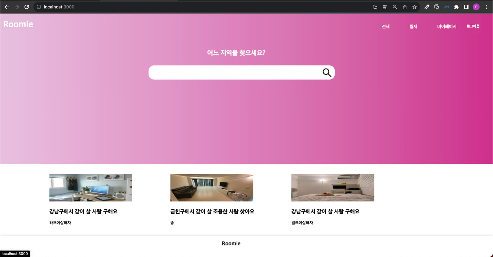
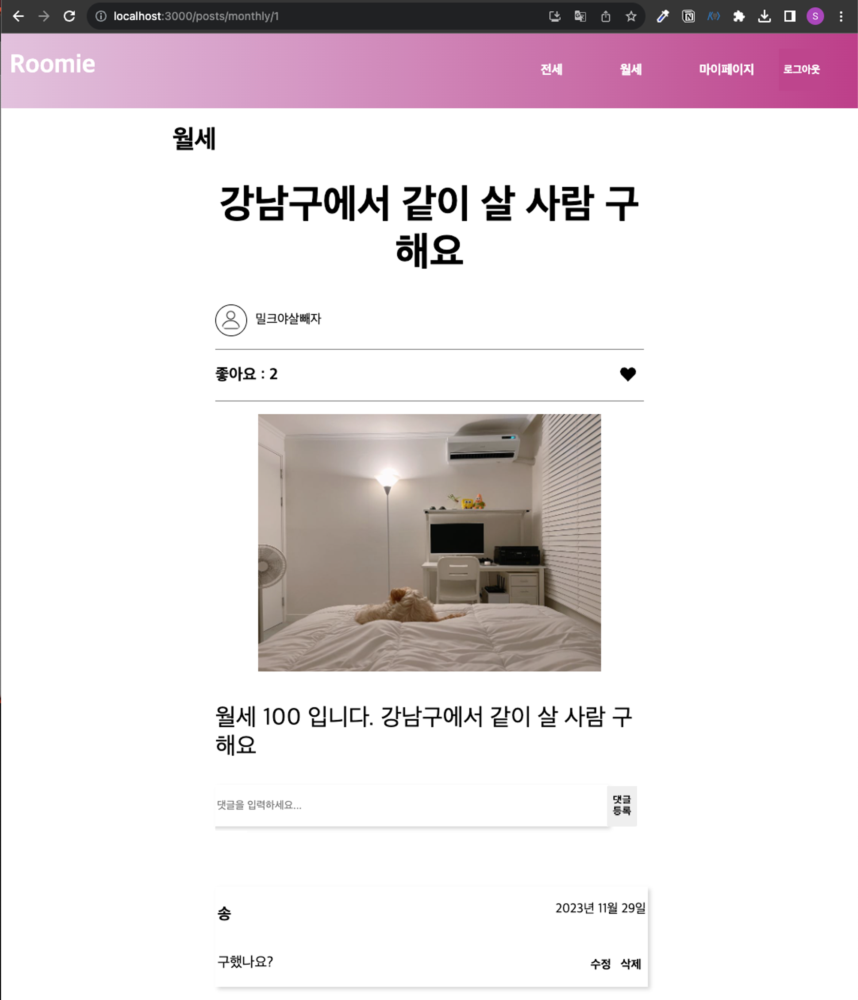
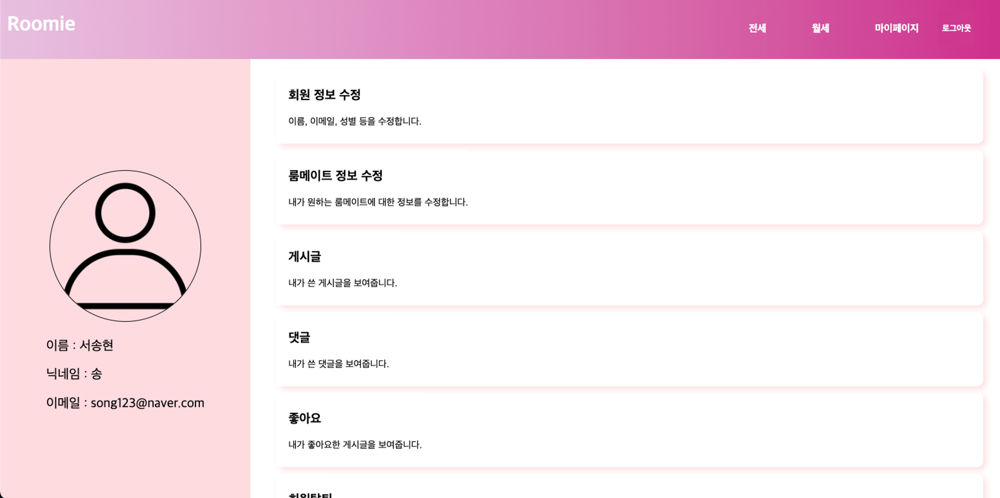
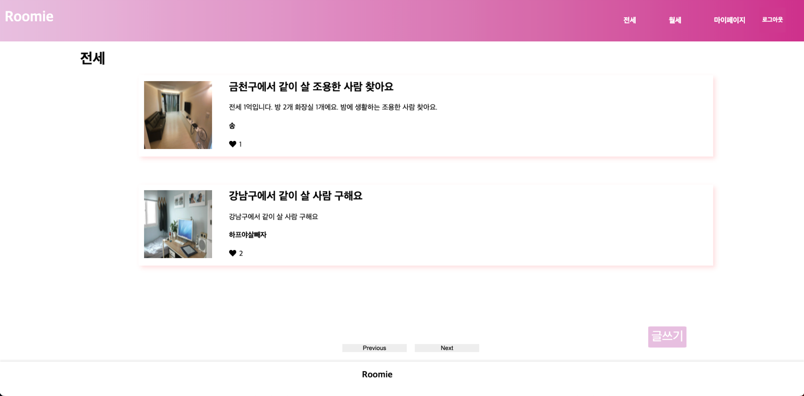
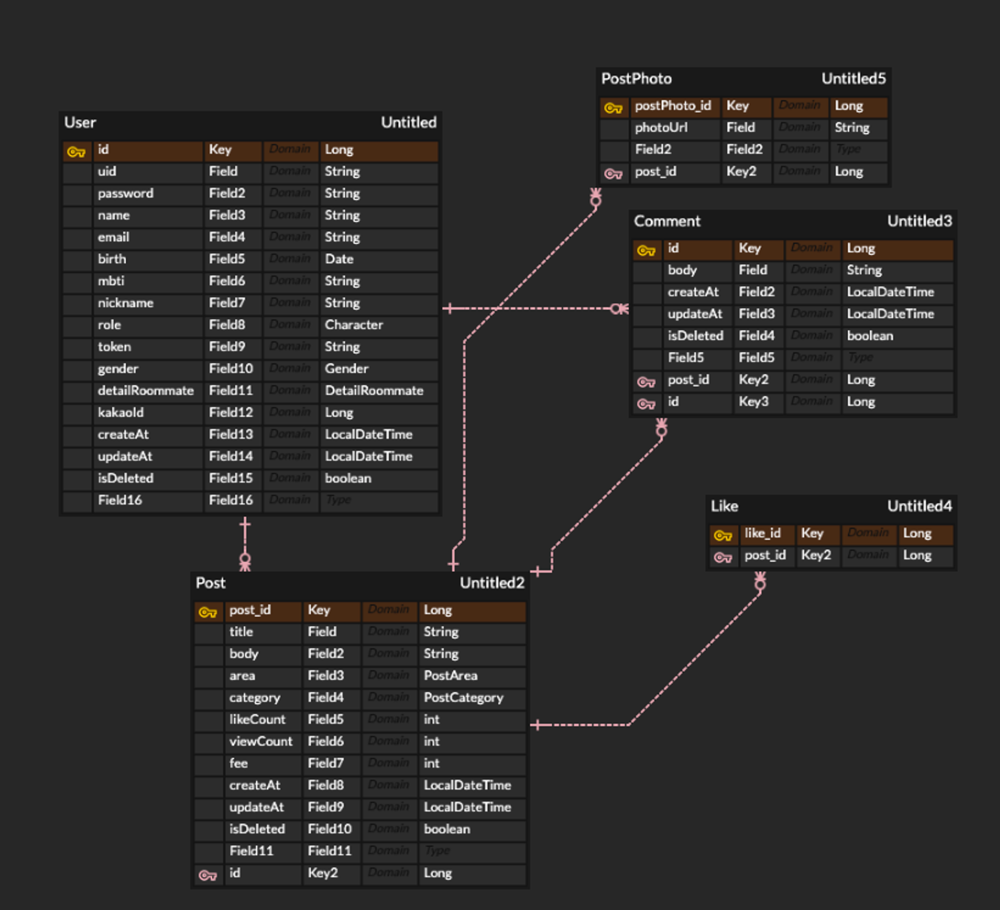
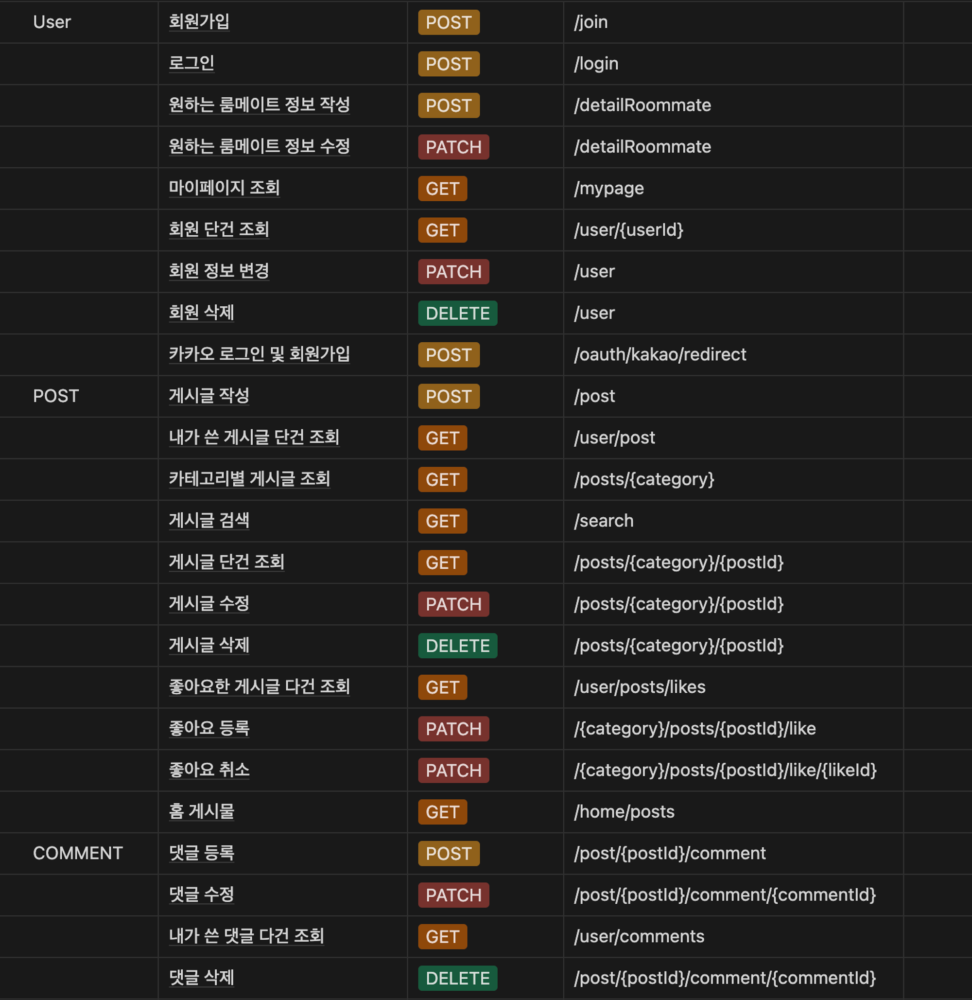

## Roomie

---
### 프로젝트 소개

최근 주택 가격 상승으로 인해 혼자 자취하는 것이 부담스러운 분들을 위한 룸메이트 매칭 웹사이트입니다. 이 서비스는 해외에 있는 룸메이트를 찾을 수 있는 플랫폼을 모티브로 하여 만들었습니다.

핵심 기능 중 하나는 MBTI 궁합표를 활용하여 사용자에게 맞춤형 룸메이트를 추천하며, 조회수와 좋아요수를 고려한 게시글도 추천해줍니다. 

### **프로젝트 기간 / 인원**

2023.08 ~ 2023.12

개인 프로젝트

### 개발 환경

- **Backend** : SpringBoot framework, JPA, MySQL, JAVA
- **Frontend** : HTML, CSS, JS, REACT

### 핵심 기능

- MBTI 궁합표를 활용한 게시글 추천
- 인기 게시글 추천
- 키워드 검색

### 서비스 UI

||  |
|:--:|:------------:|
|||
---
## Database Schema Diagram

---

## API

